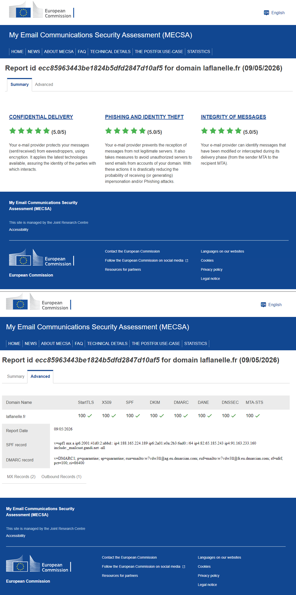

# Production Mail Infrastructure — Postfix / Rspamd / Dovecot, Hardened

> Hardened Postfix + Dovecot + Rspamd configuration set for a small
> production mail platform with primary and secondary MX, full
> SPF/DKIM/DMARC/ARC chain, DANE + MTA-STS, postscreen, milter-based
> Rspamd integration, and tuned anti-spam policies. Continuously
> maintained since 2001 (sendmail → Postfix in 2003, then through
> SpamAssassin → Rspamd and Spamhaus → Spamhaus DQS → Abusix migrations).

[](LICENSE)
[](https://creativecommons.org/licenses/by-sa/4.0/)
[](#)
[](#)

---

## Why this repository exists

This is the configuration set of a small production mail platform that
I have administered in autonomy since 2018 (the configuration lineage
goes back to 2001: sendmail → Postfix 2003 → SpamAssassin → Rspamd →
Spamhaus → Spamhaus DQS → Abusix Mail Intelligence, several rewrites
and provider migrations later). It serves a 24/7 e-commerce activity
with international exchanges, manages 13 domains, processes 150/200
messages per day, and has run with **zero security incidents** and
**zero direct blacklisting** over its lifetime. The platform did face
occasional OVH multi-tenant IP block listings, managed by proactive
DNSWL registration and partner whitelisting.

The platform's broader architecture is documented in the companion
repository
[`Lionel-Rousseau/laflanelle-secops-architecture`](https://github.com/Lionel-Rousseau/laflanelle-secops-architecture).
The backup chain that protects this stack lives in
[`Lionel-Rousseau/linux-prod-backup-toolbox`](https://github.com/Lionel-Rousseau/linux-prod-backup-toolbox).

## Headline posture

- **Postscreen + DNSBL screening** in front of `smtpd` on port 25,
  with a curated CIDR-based override list for allowlist and reject
  decisions.
- **Greylisting** (Rspamd module, Redis-backed, 1 h lifetime) on top
  of postscreen, calibrated with a low-friction whitelist for
  known-good senders.
- **Bayes classifier** trained continuously through Sieve scripts
  wired to per-user IMAP folders.
- **Full authentication chain**: SPF (record + `policyd-spf`), DKIM
  signing per domain via OpenDKIM milter (RSA 2048-bit keys, annual
  rotation; one legacy domain at a Korean registrar retains 1024-bit
  due to registrar key-length cap), DMARC `p=quarantine`, OpenARC
  1.3.0 sealing for multi-hop traffic, validation at receive time.
- **TLS 1.2 minimum** with hardened cipher suites (FFDHE4096 DH
  parameters, no export/CBC/legacy suites), DANE on outbound (TLSA
  records), MTA-STS published and enforced.
- **Abusix `authbl` on submission ports 587 / 465**: IPs known for
  authenticated spam are blocked *before* SASL credentials are
  validated, not after.
- **ClamAV** for attachment scanning, integrated via Rspamd.
- **Custom Rspamd settings module** entries (`local.d/perso.conf`)
  suppressing RBL / Bayes / URIBL false positives for logwatch cron
  mail, with a negative-score audit symbol to make the exemption
  visible in headers.
- **Geo-blocking + threat-feed aggregation** at the iptables layer,
  refreshed daily (FireHOL Level 1, AbuseIPDB ≥ 90%, dshield).

Configuration independently verified by the
[MECSA (EU/JRC)](https://mecsa.jrc.ec.europa.eu/en/finderRequest/ecc85963443be1824b5dfd2847d10af5)
tool — **100/100 on all 8 criteria** (StartTLS, X509, SPF, DKIM, DMARC,
DANE, DNSSEC, MTA-STS), **5.0/5 on all 3 dimensions** (Confidential
Delivery, Phishing & Identity Theft, Integrity of Messages), both MX
records negotiating TLSv1.3 / TLS_AES_256_GCM_SHA384 — as of May 2026.



## What is in this repository

```
postfix-rspamd-hardened-config/
├── README.md
├── LICENSE                            MIT for code, CC-BY-SA 4.0 for docs
├── .gitignore                         Explicitly excludes keys, maps, dynamic feeds
├── docs/
│   ├── architecture.md                Topology, DNS records, inbound/outbound flows
│   ├── hardening-decisions.md         Rationale for 11 non-obvious choices
│   ├── mecsa-report-summary.png       MECSA 5.0/5 verification screenshot (May 2026)
│   └── examples/
│       └── perso.conf.example         Rspamd local.d template snippets
├── primary/
│   ├── openarc.conf                   OpenARC 1.3.0 — ARC sealing, RSA 2048-bit
│   ├── dovecot/
│   │   └── dovecot.conf               Dovecot 2.4.2 — IMAP/SASL/LMTP + IMAPSieve
│   │                                  Bayes training pipeline
│   ├── opendkim/
│   │   ├── opendkim.conf              OpenDKIM — 12-domain signing, DNSSEC, 1024/2048
│   │   ├── KeyTable                   Per-domain key paths with registrar-limit note
│   │   └── SigningTable               Wildcard *@domain → selector mapping
│   ├── postfix/
│   │   ├── main.cf                    Restriction chains, postscreen, TLS, DANE, milters
│   │   ├── master.cf                  Ports 25/587/465 with authbl pre-AUTH check
│   │   └── tls_config.conf            OpenSSL signature algorithm policy
│   ├── rspamd/
│   │   └── local.d/
│   │       ├── antivirus.conf         ClamAV via Unix socket, EICAR test support
│   │       ├── force_actions.conf     Virus rejection logic (centralised)
│   │       ├── milter_headers.conf    X-Spam-Score + Authentication-Results headers
│   │       ├── perso.conf             Logwatch false-positive suppression
│   │       ├── rbl.conf               Abusix (active) + Spamhaus DQS (retired, commented)
│   │       └── settings.conf          Root@ notification exceptions — primary + secondary
│   └── scripts/
│       └── update-datashield.sh       Daily IP threat-feed → atomic ipset swap
├── secondary/
│   └── postfix/
│       ├── main.cf                    Relay-only, 13-domain, 15d queue, relaxed policy
│       └── master.cf                  Ports 587/465 disabled with rationale
└── fail2ban/
    ├── jail.d/
    │   └── custom.conf                All active jails — progressive ban, Cloudflare,
    │                                  subnet-level blocking, postscreen escalation
    ├── filter.d/
    │   ├── postscreen-aggr.conf       PREGREET + HANGUP event detection
    │   └── f2b-postfix-subnet.conf    Escalates postfix-sasl bans to /24 subnet
    └── action.d/
        ├── ipset-subnet24.conf        /24 subnet block via ipset hash:net
        └── cloudflare-token.conf      Cloudflare firewall API integration
```

## Highlights: what to look at first

If you have ten minutes and want to evaluate this work:

1. **[`primary/postfix/main.cf`](primary/postfix/main.cf)** — the
   core. Read the `smtpd_*_restrictions` chains (six stages, ordered
   by evaluation cost), the postscreen DNSBL scoring block (Abusix
   feeds weighted at ×2, whitelist at −1), and the TLS hardening
   section (FFDHE4096, cipher exclusions, protocol floor).

2. **[`primary/postfix/master.cf`](primary/postfix/master.cf)** — note
   the Abusix `authbl` check in `smtpd_relay_restrictions` on both
   ports 587 and 465: IPs known for authenticated spam are blocked
   *before* SASL credentials are validated.

3. **[`primary/rspamd/local.d/rbl.conf`](primary/rspamd/local.d/rbl.conf)**
   — active Abusix configuration plus the complete Spamhaus DQS
   configuration in comments. Read both sections to understand the
   migration decision (documented in `hardening-decisions.md`).

4. **[`fail2ban/jail.d/custom.conf`](fail2ban/jail.d/custom.conf)**
   — layered automated defence: progressive ban schedules with
   multipliers, postscreen event escalation, /24 subnet banning when
   the same network generates multiple offenders, and dual
   iptables + Cloudflare blocking on operator-triggered bans.

5. **[`primary/dovecot/dovecot.conf`](primary/dovecot/dovecot.conf)**
   — IMAP/SASL/LMTP stack. Note the IMAPSieve Bayes training pipeline:
   moving messages to/from the Junk folder automatically triggers
   Rspamd classifier training via external Sieve scripts.

6. **[`docs/hardening-decisions.md`](docs/hardening-decisions.md)**
   — explains 11 choices that might otherwise look like omissions or
   misconfiguration: why `smtpd_tls_security_level = may` on port 25,
   why both DANE and MTA-STS, why the secondary has no milters, why
   `authbl` is checked before `permit_sasl_authenticated`, and more.

## Anonymisation notes

This repository is published from a real production codebase.
Hostnames, IP addresses, domain names, user names, paths, and email
addresses have been replaced with documentation placeholders
(`example.org`, `example.net`, `192.0.2.0/24`, `2001:db8::/32`,
`admin@example.org`). The control flow, hardening choices, scoring
decisions, and operational patterns are unchanged.

Abusix API keys appear as `<ABUSIX-API-KEY>` throughout — the same
key prefix is used in `primary/postfix/main.cf` (postscreen DNSBL
sites, `reject_rhsbl_*`), `primary/postfix/master.cf` (`authbl` on
submission ports), and `primary/rspamd/local.d/rbl.conf`.

Files containing personal or operational data (the actual
`sender_checks`, `transport`, `rbl_override`, DKIM whitelist maps,
etc.) are excluded from this repository — see `.gitignore` for the
complete list.

## What is NOT in this repository

By design:

- **DKIM private keys** — RSA 2048-bit per domain (1024-bit for the
  registrar-limited domain), stored under `/etc/opendkim/keys/`. Never
  published, even rotated ones.
- **OpenDMARC configuration** (`opendmarc.conf`) — standard Debian
  package defaults with minimal customisation. Not published to keep
  the repository focused on the genuinely customised parts.
- **The Postfix operator maps** (`sender_checks`, `transport`,
  `rbl_override`) — contain real partner addresses and routing data.
  Excluded by `.gitignore`.
- **Dynamic threat feeds** — the `iptables/ipset/rules.v4` output of
  the daily datashield refresh (~2.6 MB). Script output, not
  static configuration.
- **Stock vendor files** — Rspamd `modules.d/` defaults (56 files,
  all overridden by the `local.d/` files published here), fail2ban
  stock filter library (~150 files), Dovecot `conf.d/` defaults
  (superseded by the Dovecot 2.4.x single-file configuration model),
  Sieve training scripts (`report-spam.sieve`, `report-ham.sieve`).

## On the production of this repository

The configuration set described here has been maintained in production
since 2001 (across migrations from sendmail to Postfix, SpamAssassin
to Rspamd, and several DNSBL providers). The configuration choices,
threat-model decisions, and operational patterns are the author's,
accumulated over twenty-five years of running mail infrastructure.
The work of distilling, anonymising, restructuring, and documenting
these artefacts for public release was assisted by Claude (Anthropic).
Every file was reviewed and validated by the author before publication.

## License

- Source code (scripts): [MIT](LICENSE)
- Configuration files and documentation:
  [CC-BY-SA 4.0](https://creativecommons.org/licenses/by-sa/4.0/)

## About

Maintained by **Lionel Rousseau** — Linux administrator and SecOps
practitioner, CompTIA Security+ and CySA+ certified.
[`lionel@rousseau.kr`](mailto:lionel@rousseau.kr) ·
[LinkedIn](https://www.linkedin.com/in/lionel-rousseau-kr/) ·
[GitHub](https://github.com/Lionel-Rousseau).
